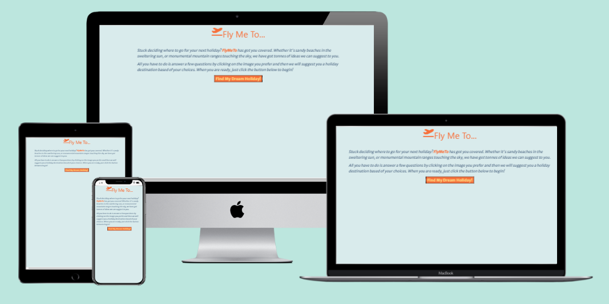
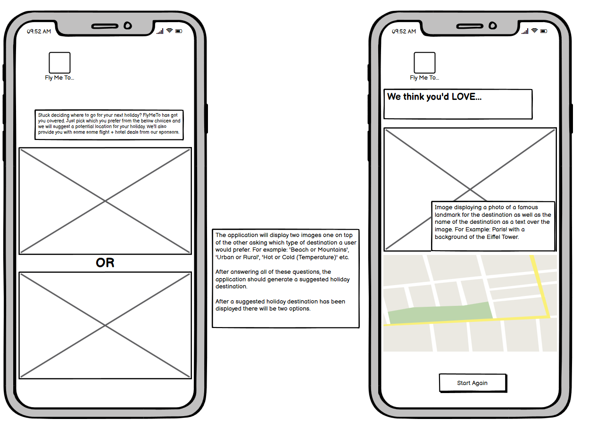
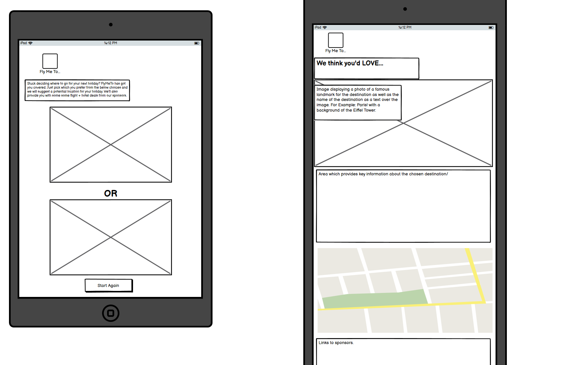
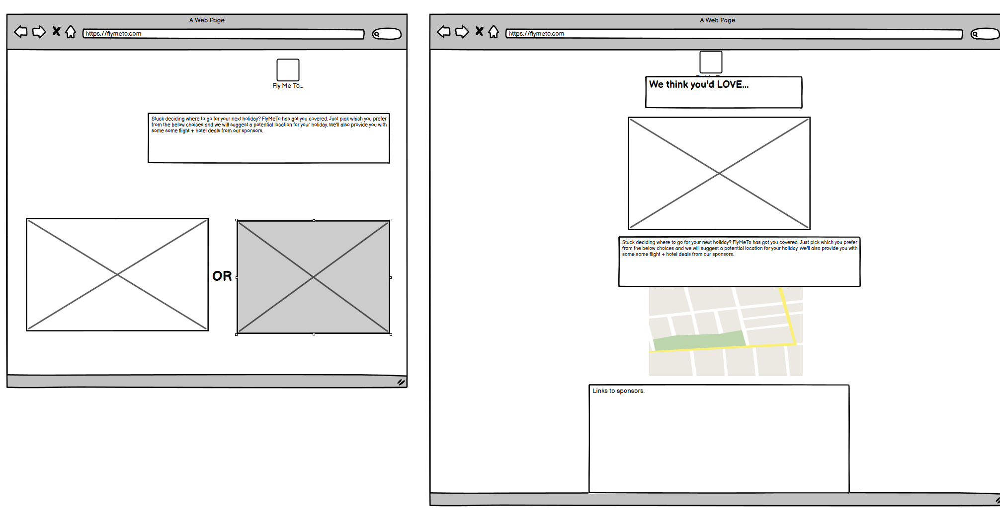

# FlyMeTo README
Here is a link to the website [FlyMeTo](https://8000-alikarimini-milestonepr-wq06ezr4i1m.ws-eu46.gitpod.io/index.html)

## What is this ReadME for?
This is the ReadMe for the website for the fictional web application called FlyMeTo. FlyMeTo is a web-based app built using HTML, CSS and JavaScript. Its target audience are those who are looking for a potential holiday destination. Through the asking of some questions, the application will suggest a potential holiday location based off of the answers users give. 

## Table of Contents
* [User Experience Design (UX)](#UX)
    * [The Strategy Plane](#The-Strategy-Plane)
        * [Site Goals](#Site-Goals)
        * [User Stories](#User-Stories)
    * [The Scope Plane](#The-Scope-Plane)
    * [The Structure Plane](#The-Structure-Plane)
    * [The Skeleton Plane](#The-Skeleton-Plane)
        * [Wireframes](#Wireframe-mockups)
    * [The Surface Plane](#The-Surface-Plane)

## UX

### The Strategy Plane
* FlyMeTo intends on being a creative way of helping users find their next potential holiday destination. Through the use of asking the user questions, with the aid of emotion-provoking images, the app aims to suggest a holiday location based of the user’s answers.

#### Site Goals
* To provide users with a fun and creative way of identifying their next holiday destination.
* To ensure that the app is easy to use and quick in suggesting potential locations.
* To provide users with an option to easily restart the site.
* To ensure that the site is fully accessible on desktop and touch screen devices.
* To ensure that the app is fully compliant with keyboard commands and screen readers.

#### User Stories
* As a user, I want a fun and creative way of finding my next holiday destination.
* As a user, I want to be able to easily utilise the site and get a holiday destination suggestion fast.
* As a user I want to be able to use this site with my keyboard
* As a user I want to be able to use a screen reader to help use this site.

### The Scope Plane
Features Planned
* A single page which includes all the sites features. 
* Responsive Design allowing the user to correctly operate the site across a range of devices the user could potentially use such as Desktop, Laptop, Tablet and Mobile's.
* The option to run the questions again from the start.
* The option to re-use the user’s selected answers to avoid time wasted in the instance the user wants a different location suggested but would not want to answer the questions differently.
* The site should be fully accessible for keyboard users
* The site should be fully accessible for screen reader users

### The Structure Plane
User Story:

> As a user, I want a fun and creative way of finding my next holiday destination.

Acceptance Criteria:
* It should be clear that it is a site designed to identify a holiday destination.

Implementation:
* The website name, colour scheme font choice and introductory text all convey a to the user that this is a different and fun way of identifying the user's next holdiday destination. The  introductory text explains the purpose of the site in a clear and concise way and the focal point of the intitial page is the "Find my dream holiday!" button.

User Story:

> As a user, I want to be able to easily utilise the site and get a holiday destination suggestion fast.

Acceptance Criteria:
* The start to the end of the application should be easily achieved in just a few clicks. 

Implementation:
* The end screen which displays a potential holiday destination can be achieved through just 5 clicks. The site is responsive to give visual feedback when an option can be clicked - either through the use of the cursor icon changing to a pointer for the buttons and clicable images as well as the buttons changing colours on hover. Home button allows for an easy restart of the application.

User Story:

> As a user I want to be able to use this site with my keyboard

Acceptance Criteria:
* It should be entirely possible for an individual utilising a keyboard only to be able to click "Find my dream holiday!" button, home button and select on option a or option b image.

Implementation:
* The user will be able to navigate the site using only a keyboard. All elements will be individually selectable through the keyboard and standard keyboard controls.

### The Skeleton Plane
#### Wireframe Mockups 
I utilised Balsamiq to produce my wireframes of how the app would appear across different devices. The app was intended to be contained within one page, however as the app required different content to be loaded at different times, the wireframes display a combination of different views of the site, with the introductory view and images seen in one and then the final page view adjacent to it.

Mobile Device Wireframes 
 
 

Tablet Device Wireframes

 

Desktop Device Wireframes
 

